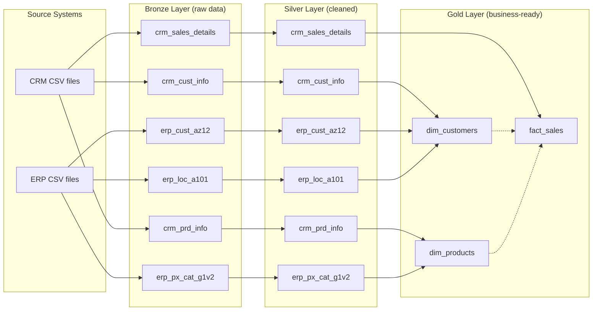

# Data Flow

This diagram shows how data moves from source systems through the Bronze,
Silver, and Gold layers, based on the tables identified during profiling.

## Notes

- **Dotted lines** into `fact_sales` represent key relationships (the fact
  table references `dim_customers` and `dim_products` via surrogate keys),
  not a direct data transformation — the actual sales data comes from
  `crm_sales_details`.
- `dim_customers` combines CRM customer data (`crm_cust_info`) with ERP
  demographic and location data (`erp_cust_az12`, `erp_loc_a101`).
- `dim_products` combines CRM product data (`crm_prd_info`) with ERP
  category data (`erp_px_cat_g1v2`).
- Bronze and Silver tables share the same names by design (see naming
  conventions) — only the Gold layer introduces new, business-facing names.
