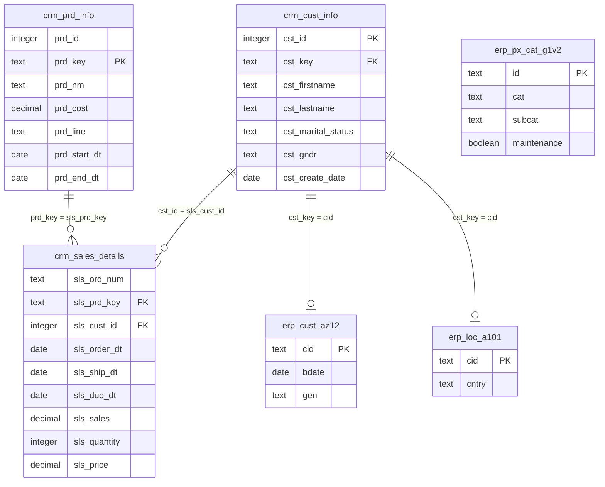

# Integration Model

This diagram shows how data is connected across all the tables

```mermaid
    erDiagram

    crm_cust_info {
        integer cst_id PK
        text cst_key FK
        text cst_firstname
        text cst_lastname
        text cst_marital_status
        text cst_gndr
        date cst_create_date
    }

    crm_prd_info {
        integer prd_id
        text prd_key PK
        text prd_nm
        decimal prd_cost
        text prd_line
        date prd_start_dt
        date prd_end_dt
    }

    crm_sales_details {
        text sls_ord_num 
        text sls_prd_key FK
        integer sls_cust_id FK
        date sls_order_dt
        date sls_ship_dt
        date sls_due_dt
        decimal sls_sales
        integer sls_quantity
        decimal sls_price
    }

    erp_cust_az12 {
        text cid PK
        date bdate
        text gen
    }

    erp_loc_a101 {
        text cid PK
        text cntry
    }

    erp_px_cat_g1v2 {
        text id PK
        text cat
        text subcat
        boolean maintenance
    }


crm_cust_info ||--o{ crm_sales_details : "cst_id = sls_cust_id"
crm_prd_info ||--o{ crm_sales_details : "prd_key = sls_prd_key"
crm_cust_info ||--o| erp_cust_az12 : "cst_key = cid"
crm_cust_info ||--o| erp_loc_a101 : "cst_key = cid"

```

