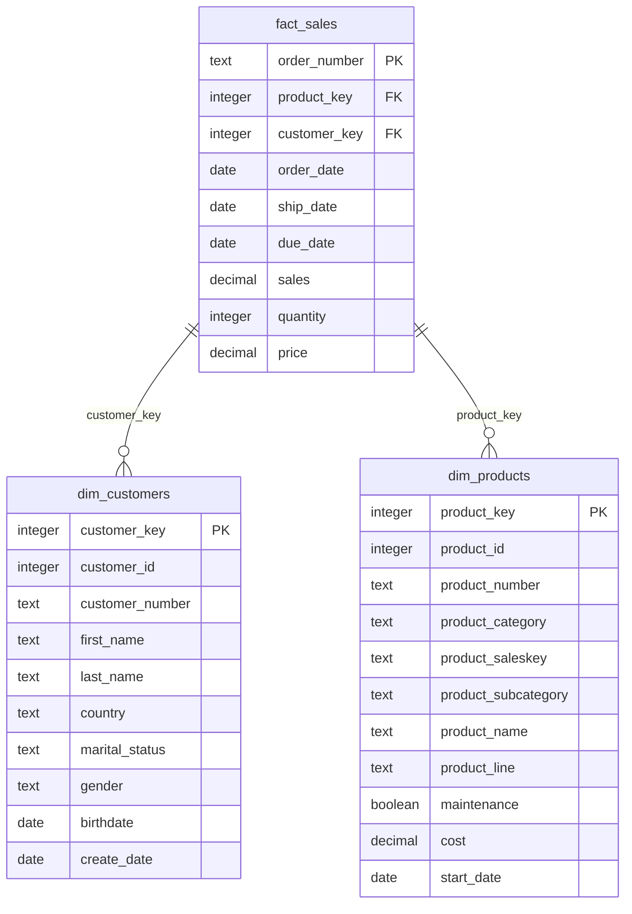

```mermaid
    erDiagram

    fact_sales {
        text order_number PK
        integer product_key FK
        integer customer_key FK
        date order_date
        date ship_date
        date due_date
        decimal sales
        integer quantity
        decimal price
    }

    dim_customers {
        integer customer_key PK
        integer customer_id
        text customer_number
        text first_name
        text last_name
        text country
        text marital_status
        text gender
        date birthdate
        date create_date
    }

    dim_products {
        integer product_key PK
        integer product_id
        text product_number
        text product_category
        text product_saleskey
        text product_subcategory
        text product_name
        text product_line
        boolean maintenance
        decimal cost
        date start_date
    }


    fact_sales ||--o{ dim_customers : "customer_key"
    fact_sales ||--o{ dim_products : "product_key"
```